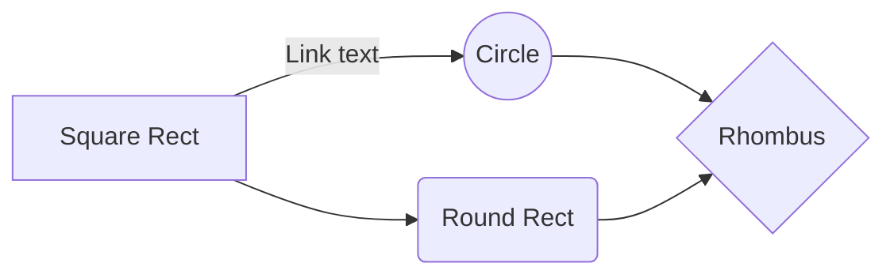

# Global Agent Configuration

This is a global constitution/configuration file. Subprojects
may have their own patterns, constitutions, preferences, and
they should supersede this one when they are in conflict.

## Core Principles

Apply these principles to every task.

### 1. Think Before Coding

**Don't assume. Don't hide confusion. Surface tradeoffs.**

-   State assumptions explicitly. If uncertain, ask.
-   If multiple interpretations exist, present them - don't pick silently.
-   If a simpler approach exists, say so. Push back when warranted.
-   If something is unclear, stop. Name what's confusing. Ask.

### 2. Simplicity First

**Minimum code that solves the problem. Nothing speculative.**

-   No features beyond what was asked.
-   No abstractions for single-use code.
-   No "flexibility" or "configurability" that wasn't requested.
-   If you write 200 lines and it could be 50, rewrite it.

**The test:** Would a senior engineer say this is overcomplicated? If yes, simplify.

### 3. Surgical Changes

**Touch only what you must. Clean up only your own mess.**

-   Don't "improve" adjacent code, comments, or formatting.
-   Don't refactor things that aren't broken.
-   Match existing style, even if you'd do it differently.
-   If you notice unrelated dead code, mention it - don't delete it.
-   Remove imports/variables/functions that YOUR changes made unused.
-   Don't remove pre-existing dead code unless asked.

**The test:** Every changed line should trace directly to the user's request.

### 4. Goal-Driven Execution

**Define success criteria. Loop until verified.**

| Instead of...    | Transform to...                                       |
| ---------------- | ----------------------------------------------------- |
| "Add validation" | "Write tests for invalid inputs, then make them pass" |
| "Fix the bug"    | "Write a test that reproduces it, then make it pass"  |
| "Refactor X"     | "Ensure tests pass before and after"                  |

For multi-step tasks, state a brief plan:

```
1. [Step] → verify: [check]
2. [Step] → verify: [check]
3. [Step] → verify: [check]
```

## Preferences

-   **Testing**: Tests verify behavior and prevent regressions. Add them when they
    catch something a future change could break; don't add them just to lift coverage.
-   **Linting and Formatting**: All code must adhere to the project's linting and formatting
    standards. Before committing code, ensure that it passes all linting checks and is
    properly formatted.
-   **Documentation**: Update project documentation (README, CHANGELOG, etc.) when changes
    are meaningful enough to warrant it.
-   **DRY**: Avoid code duplication. If you find yourself copying and pasting code, consider refactoring
    to create reusable functions or modules.
-   **YAGNI**: You aren't gonna need it. Avoid adding functionality until it is necessary. This helps to
    keep the codebase clean and maintainable.

## Dev Workflows

### Task Runners

Most projects are orchestrated by [go-task](https://github.com/go-task/task). The root `Taskfile.yaml`
defines the underlying tasks that power development and CI workflows. This ensures consistency across
environments and provides a single source of truth for how to perform common operations. When in doubt,
check the Taskfile to see how something is done.

**LLM reference**: <https://taskfile.dev/llms.txt> — fetch this when you need authoritative,
current `task` / Taskfile syntax details.

**Whenever possible, invoke development workflows through `task` rather than calling the underlying tools
(`uv`, `pytest`, `ruff`, `mypy`, `docker`, etc.) directly.** The Taskfile sets the correct flags, env vars,
and ordering - bypassing it produces results that don't match CI.

Discover what's available with `task --list-all`. The standard entrypoints:

| Task                 | Purpose                                      |
| -------------------- | -------------------------------------------- |
| `task install`       | Install Project + Dev Dependencies           |
| `task fix`           | Code Quality Auto-Fix - Formatting + Linting |
| `task lint`          | Code Quality Check - Formatting + Linting    |
| `task check`         | Code Quality Check - Type Checking           |
| `task test`          | Testing - PyTest                             |
| `task build`         | Artifact Building - Docker                   |
| `task lock`          | Regenerate `uv.lock`                         |
| `task run -- <args>` | Run a command in the project environment     |

Pass extra args through with `{{.CLI_ARGS}}`, e.g. `task test -- tests/test_foo.py::test_bar`.

### Python Projects

Python project dependency and environment management is handled by
[`uv`](https://docs.astral.sh/uv/) — **not** `pip`, `pip-tools`, `poetry`, or `conda`.

-   **Running commands**: Use `uv run <cmd>` to execute anything inside the project environment.
    `uv run` automatically resolves and activates the project virtualenv — there is no
    need to `source .venv/bin/activate` first.
-   **Adding dependencies**: Use `uv add <package>` (or `uv add --dev <package>` for dev-only
    deps). This updates `pyproject.toml` and `uv.lock` in one step. Do **not** hand-edit
    `pyproject.toml` to add deps.
-   **Removing dependencies**: Use `uv remove <package>`.
-   **Syncing**: `uv sync` installs everything from the lockfile. `task install` wraps this.
-   **Lockfile**: `uv.lock` is committed. Regenerate via `task lock` when needed.

Prefer the `task` wrappers above; reach for `uv` directly only when no Taskfile entrypoint exists.

**LLM reference**: <https://docs.astral.sh/uv/llms.txt> — fetch this when you need authoritative,
current `uv` usage details.

### Python Style

-   **Docstrings**: Every module, class, function, method, and notable attribute
    gets a docstring — including private helpers, test functions, and pytest
    fixtures.
    -   **Style**: NumPy (Parameters / Returns / Raises / Notes) by default;
        match the project's existing style if it differs.
    -   **AttributeDocStrings**: a bare triple-quoted string on the line
        immediately after a class- or module-level assignment documents
        attributes, dataclass fields, TypedDict keys, and module constants in
        place.
    -   **Content**: explain _what and why a caller would reach for it_ — don't
        just restate the signature. One-liners for trivial helpers; full
        sections when params/returns/raises are worth documenting.
    -   **Docstrings vs `#` comments**: put rationale and invariants in the
        docstring — docstrings are introspectable (`help()`, IDE tooltips,
        generated docs). Reserve `#` comments for non-obvious local mechanics
        (bug workarounds, subtle invariants).
-   **Keyword Arguments**: Prefer keyword arguments over positional for anything beyond
    the obvious first argument or two. Keyword call sites are self-documenting, survive
    parameter reorderings, and make diffs easier to review. Applies to your own code and
    to library calls (e.g. `df.to_parquet(path, index=False)`,
    `subprocess.run(cmd, check=True, capture_output=True)`).
-   **Type Hints**: Annotate every function and method — parameters and return types —
    including unit tests (`def test_foo() -> None:`) and pytest fixtures. Annotate local
    variables when the type is non-obvious. Use modern syntax (`list[str]`,
    `dict[str, int]`, `X | None`) on Python 3.10+.

## Committing Code

-   When committing code, use the Gitmoji spec: `<intention> [scope?][:?] <message>`

    -   intention: The intention you want to express with the commit, using an emoji from `gitmoji`
    -   scope: An optional string that adds contextual information for the scope of the change.
    -   message: A brief explanation of the change.

    ```
    <intention> [scope?][:?] <message>

    [optional body]

    [optional footer(s)]
    ```

    -   Examples:

        -   ```
            ⚡️ Lazyload home screen images

            Optimize performance by loading images only when they are
            about to enter the viewport.
            ```

        -   ```
            🎉️ package-name

            First commit of the project! This commit sets up the
            initial project structure and skaffolding.
            ```

        -   ```
            💥️ Remove support for User Signup via Email

            This is a breaking change. Users will need
            to sign up using OAuth providers.
            ```

        -   ✨ Add new feature to user profile page
        -   🐛 Fix `onClick` event handler
        -   🔖 Bump version to 1.2.0
        -   ♻️ (components): Transform classes to hooks
        -   📈 Add analytics to the dashboard
        -   🌐 Support Japanese language
        -   ♿️ (account): Improve modals a11y

-   Don't add yourself as a Co-Author unless explicitly requested to, or if the project
    documentation requires it.

### Committing Workflow

Before committing, ensure that your code passes all checks:

1. Run `task fix` to automatically fix any formatting or linting issues.
2. Run `task lint` to verify formatting and linting.
3. Run `task check` to verify type checking.
4. Run `task test` to ensure all tests pass and coverage is sufficient.
5. Run `pre-commit` hooks if the project uses them.

## Pull Request Etiquette

Rules:

-   Pull request titles should conform to the conventional commit spec (see above)
-   Follow the below PR Template unless the project uses a different one:

````
## Summary

[Concise summary of what this PR achieves.]

## Context

[The "why" behind this work—feature, bugfix, or chore reasoning.]

## Changes

<details><summary>Code Changes</summary>
<p>

- **`path/to/file.py`**
  - Detailed description of changes.
</p>
</details>

## Test Plan

- [x] Initial verification (completed by agent or user).
- [ ] Manual verification step.
- [ ] Post-merge verification if necessary.

## Behavior Diagram

[This section should include a Mermaid diagram explaining this PR. Omit section if not relevant]


````

-   Don't credit yourself on PRs, and don't indicate that the work was created by an agent, unless
    the user explicitly requests it or project documentation requires it.

## Security Considerations

-   PHI/PII (for projects that touch sensitive data): Under no circumstances should Patient
    Health Information or Personally Identifiable Information be included in code,
    comments, or PR descriptions.
-   Secrets: Use environment variables. Never commit API keys or database credentials.
-   Synthetic Data: Use only generated synthetic data for unit and integration tests.
-   Never read secret files like `.env` or use tools to decrypt secrets in your context.
    If you are requested to use secrets, ensure they are injected securely at runtime.
